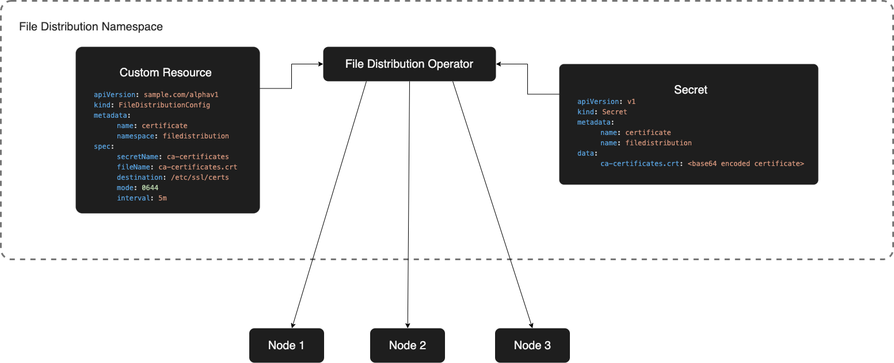
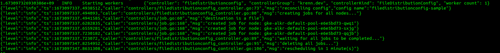

# File Distribution Operator 

Simple operator to distribute files to all nodes in a cluster



## Description

This operator will be responsible for distributing files to nodes. It does this by mounting a Secret to a defined path on the node.

The operator will be configurable by a CustomResource which will define the following:

- `secretName` - The name of the secret where the files are stored
- `fileName` - The name of the field in the secret where the file is stored (if not specified, all files in the secret will be mounted)
- `destination` - The destination path on the node where the files will be mounted. This path will be relative to the root of the node's filesystem.
- `interval` - The interval at which the files will be checked for updates. This interval will be in seconds.
- `mode` - The mode of the file(s) to be distributed. 

For security reasons, only CRs and secrets in the same namespace that the operator is deployed to will be allowed to be processed.

## Getting Started
You’ll need a Kubernetes cluster to run against. You can use [KIND](https://sigs.k8s.io/kind) to get a local cluster for testing, or run against a remote cluster.
**Note:** Your controller will automatically use the current context in your kubeconfig file (i.e. whatever cluster `kubectl cluster-info` shows).

### Running on the cluster
1. Install Instances of Custom Resources:

```sh
kubectl apply -k config/samples/
```

2. Build and push your image to the location specified by `IMG`:
	
```sh
make docker-build docker-push IMG=<some-registry>/fdo:tag
```
	
3. Deploy the controller to the cluster with the image specified by `IMG`:

```sh
make deploy IMG=<some-registry>/fdo:tag
```

### Check if installed correctly

After installing the operator one can check if it works the following way:

a.) Check the logs of the operator pod

This can be done by running the following command:

```sh
kubectl logs -f -n fdo-system <name of the operator pod>
```

If the operator was correctly installed and deployed, the output should look similar to following screenshot:



b.) Check nodes

Another way of making sure that the operator is working properly, is to check whether the specified file is available in
the nodes of the Kubernetes cluster. It depends on the cluster how one can connect to the nodes.

### Uninstall CRDs
To delete the CRDs from the cluster:

```sh
make uninstall
```

### Undeploy controller
UnDeploy the controller to the cluster:

```sh
make undeploy
```

### How it works
This project aims to follow the Kubernetes [Operator pattern](https://kubernetes.io/docs/concepts/extend-kubernetes/operator/)

It uses [Controllers](https://kubernetes.io/docs/concepts/architecture/controller/) 
which provides a reconcile function responsible for synchronizing resources untile the desired state is reached on the cluster 

### Test It Out
1. Install the CRDs into the cluster:

```sh
make install
```

2. Run your controller (this will run in the foreground, so switch to a new terminal if you want to leave it running):

```sh
make run
```

**NOTE:** You can also run this in one step by running: `make install run`

### Modifying the API definitions
If you are editing the API definitions, generate the manifests such as CRs or CRDs using:

```sh
make manifests
```

**NOTE:** Run `make --help` for more information on all potential `make` targets

More information can be found via the [Kubebuilder Documentation](https://book.kubebuilder.io/introduction.html)

## License

Copyright 2022.

Licensed under the Apache License, Version 2.0 (the "License");
you may not use this file except in compliance with the License.
You may obtain a copy of the License at

    http://www.apache.org/licenses/LICENSE-2.0

Unless required by applicable law or agreed to in writing, software
distributed under the License is distributed on an "AS IS" BASIS,
WITHOUT WARRANTIES OR CONDITIONS OF ANY KIND, either express or implied.
See the License for the specific language governing permissions and
limitations under the License.

